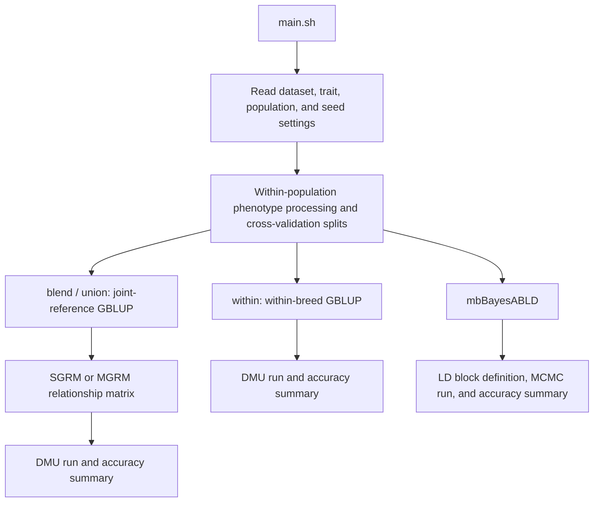

# CPGP: Purebred-Crossbred Joint Genomic Prediction Pipeline

CPGP (Crossbred records for Purebred Genomic Prediction) provides the scripts, input files, and executable programs required to reproduce the purebred-crossbred joint genomic prediction analyses in this project. The workflow uses two real datasets, the Xie2021 pig dataset and the Lee2019 beef cattle dataset, to compare within-breed GBLUP, single-trait and multi-trait joint GBLUP, standard genomic relationship matrices (SGRM), multi-population genomic relationship matrices (MGRM), and the mbBayesABLD model for predicting purebred validation groups.

This README is written for the current CPGP repository. It explains the repository layout, runtime environment, input files, model scenarios, workflow logic, output files, common run modes, and troubleshooting steps in enough detail for a new user to reproduce the analyses from the supplied genotype, phenotype, and random seed files.

> Please cite the corresponding manuscript, original data sources, and software references when using this repository. Binary programs under `code/bin/` are provided only for reproducing this project. Any other use must follow the licenses or usage agreements of the original software authors or distributors.

# User Manual

- [1. Introduction](#1-introduction)
- [2. Runtime environment and dependencies](#2-runtime-environment-and-dependencies)
- [3. Obtaining the code and data](#3-obtaining-the-code-and-data)
- [4. Repository structure](#4-repository-structure)
- [5. Initialization with initialize.sh](#5-initialization-with-initializesh)
- [6. Detailed main.sh workflow](#6-detailed-mainsh-workflow)
- [7. Important scripts and usage](#7-important-scripts-and-usage)
- [8. Input file formats and checks](#8-input-file-formats-and-checks)
- [9. Output files](#9-output-files)
- [10. Common run scenarios and example commands](#10-common-run-scenarios-and-example-commands)
- [11. Performance advice and parameter tuning](#11-performance-advice-and-parameter-tuning)
- [12. Troubleshooting](#12-troubleshooting)
- [13. FAQ](#13-faq)
- [14. License and citation](#14-license-and-citation)
- [15. Contact and acknowledgements](#15-contact-and-acknowledgements)
- [Appendix A: Example full run](#appendix-a-example-full-run)
- [Appendix B: Script call chain](#appendix-b-script-call-chain)
- [Appendix C: Example output directories](#appendix-c-example-output-directories)

# 1. Introduction

The central question of this project is whether crossbred records can provide useful reference information for improving genomic prediction in purebred validation groups when purebred and crossbred populations are genetically connected but their genetic correlation is not necessarily equal to one. This question is relevant to practical breeding programs because crossbred animals are often not direct selection candidates, while their phenotypes and genotypes may still reflect the genetic performance of purebred parental populations in commercial or crossbred production contexts.

This repository contains two real datasets:

- **Xie2021 pig dataset**: Yorkshire (YY), Landrace (LL), and Landrace x Yorkshire crossbred (LY) individuals. The analysed traits are PFAI and MS.
- **Lee2019 beef cattle dataset**: Angus (AAN), Limousin (LIM), and Lim-Flex (LF) individuals. The analysed traits are BWT and WWT.

The project compares the following model classes and evaluation scenarios:

- **Within-breed GBLUP**: uses only the training set from the target population as the reference group.
- **Single-trait joint GBLUP**: combines purebred and crossbred individuals in a joint reference population using a single-trait model.
- **Multi-trait joint GBLUP**: models records from different populations or population sources as correlated traits.
- **SGRM**: a standard VanRaden-type genomic relationship matrix.
- **MGRM**: a multi-population genomic relationship matrix that accounts for allele-frequency differences among populations, constructed by MTG2.
- **mbBayesABLD**: a multi-population Bayesian genomic prediction model based on LD blocks and heterogeneous blockwise genetic covariance structures.

The pipeline first performs within-breed cross-validation to create consistent validation folds, validation individual IDs, and adjusted phenotypes for each population. Joint evaluation models are then run within the same trait directory so that models are compared using the same validation splits.

[back to top](#user-manual)

# 2. Runtime environment and dependencies

## 2.1 Operating system and hardware

The recommended platform is a Linux server. The scripts are written in Bash and do not require Slurm, PBS, LSF, or any other job scheduler. The current workflow is designed to run directly on a regular multi-core Linux server.

Recommended resources:

- Operating system: CentOS, Rocky Linux, Ubuntu, Debian, or another mainstream Linux distribution.
- CPU: at least 20 available cores for a full run.
- Memory: at least 32 GB for GBLUP analyses; 64 GB or more is recommended for MGRM construction and mbBayesABLD.
- Disk space: at least 50 GB for cross-validation folders, relationship matrices, intermediate PLINK files, DMU output, Bayesian output, and logs.

For workflow testing, reduce `REP`, `FOLD`, `THREADS`, `MCMC_CYCLES`, and `BURNIN`.

## 2.2 Software dependencies

The following software or command-line tools are required:

```text
bash
R / Rscript
PLINK
DMU: dmu1, dmuai, run_dmu4, run_dmuai
MTG2
mbBayesABLD
gmatrix
awk, sed, grep, sort, uniq, wc, find, getopt
```

Several executables required for reproduction are placed under `code/bin/`. The `main.sh` script adds `code/bin/` to `PATH`, so users usually do not need to configure these paths manually.

## 2.3 R packages

Install the following R packages before running the workflow:

```r
install.packages(c("data.table", "dplyr", "tidyr", "stringr", "getopt", "Matrix"))
```

Some auxiliary scripts may require additional packages such as `Rcpp`, `RcppArmadillo`, or `ggplot2`. If an R script reports a missing package, install it according to the error message.

## 2.4 Binary programs

The `code/bin/` folder currently contains:

```text
plink
mtg2
dmu1
dmuai
run_dmu4
run_dmuai
gmatrix
ldblock
LD_mean_r2
mbBayesABLD
QMSim_selected
```

These programs are included only to reproduce the current project. Other uses must follow the licenses or usage terms provided by the original software authors, developers, or distributors.

[back to top](#user-manual)

# 3. Obtaining the code and data

## 3.1 Clone from GitHub

```bash
cd /path/to/workspace
git clone <repository-url> CPGP
cd CPGP
```

After cloning, check the key files:

```bash
ls README.md README_cn.md main.sh initialize.sh code data
```

## 3.2 Deploy from a compressed archive

If the server cannot access GitHub directly, upload a compressed archive and unpack it:

```bash
cd /path/to/workspace
unzip CPGP-main.zip
mv CPGP-main CPGP
cd CPGP
```

If scripts were edited on Windows, convert line endings when necessary:

```bash
dos2unix main.sh initialize.sh code/*.sh code/shell/*.sh
```

## 3.3 Post-deployment check

The project root should contain:

```text
README.md
README_cn.md
LICENSE
initialize.sh
main.sh
code/
data/
```

The `data/` directory should contain:

```text
data/Xie2021/
data/Lee2019/
```

[back to top](#user-manual)

# 4. Repository structure

## 4.1 Top-level structure

```text
CPGP/
|-- README.md
|-- README_cn.md
|-- LICENSE
|-- initialize.sh
|-- main.sh
|-- code/
|   |-- Lee2019.sh
|   |-- Xie2021.sh
|   |-- R/
|   |-- shell/
|   `-- bin/
`-- data/
    |-- Xie2021/
    |-- Lee2019/
    `-- logs/                 # generated during runs
```

Cross-validation output is written directly under `data/<dataset>/<trait>/<scenario>/`. A separate `results/` directory is not used. Example output paths are:

```text
data/Lee2019/BWT/blend_SGRM_LF_LIM/
data/Xie2021/MS/multi_YY_LL_LY/
```

## 4.2 Key files

- `main.sh`: the unified entry point. Users usually edit `PROJECT_ROOT`, `DATASETS`, `THREADS`, `FOLD`, `REP`, `RUN_STEPS`, and MCMC parameters in this file.
- `initialize.sh`: checks required input files, executable programs, `Rscript`, and Bash syntax.
- `code/shell/template_within.sh`: template script for within-breed GBLUP.
- `code/shell/template_blend_union.sh`: template script for joint GBLUP.
- `code/shell/template_multi.sh`: template script for mbBayesABLD.
- `code/shell/accur_dmu_SS_GBLUP.sh`: core cross-validation script for within-breed GBLUP.
- `code/shell/accur_multi_breed.sh`: core cross-validation script for joint GBLUP and mbBayesABLD.
- `code/shell/MTG2.sh`: constructs multi-population genomic relationship matrices.
- `code/shell/bin_define_ldblock.sh`: defines LD blocks for mbBayesABLD.
- `code/R/`: R scripts for phenotype processing, accuracy calculation, relationship matrix processing, LD blocks, local genetic correlations, and MCMC diagnostics.
- `code/bin/`: binary programs required for reproduction.

`code/Lee2019.sh` and `code/Xie2021.sh` are retained only as compatibility wrappers. They are not the recommended entry points.

## 4.3 Dataset folders

Basic input files for Xie2021:

```text
data/Xie2021/Genotype.id.qc.bed
data/Xie2021/Genotype.id.qc.bim
data/Xie2021/Genotype.id.qc.fam
data/Xie2021/phenotypes_dmu.txt
data/Xie2021/seed.txt
```

Basic input files for Lee2019:

```text
data/Lee2019/Lee2019q.bed
data/Lee2019/Lee2019q.bim
data/Lee2019/Lee2019q.fam
data/Lee2019/phenotype.txt
data/Lee2019/seed.txt
```

After running the workflow, each dataset folder will also contain trait folders, model scenario folders, cross-validation subfolders, and log files.

[back to top](#user-manual)

# 5. Initialization with initialize.sh

## 5.1 Initialization command

Run the following from the repository root:

```bash
cd /path/to/CPGP
bash initialize.sh
```

If scripts do not have executable permission, run:

```bash
chmod +x initialize.sh main.sh code/*.sh code/shell/*.sh
bash initialize.sh
```

## 5.2 What initialize.sh checks

The initialization script checks:

1. Whether the basic input files for Xie2021 and Lee2019 exist.
2. Whether the required executables exist under `code/bin/`: `plink`, `gmatrix`, `dmu1`, `dmuai`, `run_dmu4`, `run_dmuai`, `mtg2`, `mbBayesABLD`, `ldblock`, and `LD_mean_r2`.
3. Whether binary programs and shell scripts have executable permission.
4. Whether `code/*.sh` and `code/shell/*.sh` pass Bash syntax checks.
5. Whether `Rscript` is available in the current environment.
6. Whether `data/logs/` exists. It is created automatically when missing.

## 5.3 What to do if initialization fails

If a `Missing` or `Missing executable` message appears, check whether the corresponding file has been copied to the correct location and is not empty.

If `Rscript` is missing, check:

```bash
which Rscript
Rscript --version
```

If the server uses environment modules, load R first:

```bash
module load R
```

If Bash syntax checks fail, first check line endings:

```bash
dos2unix main.sh initialize.sh code/*.sh code/shell/*.sh
```

[back to top](#user-manual)

# 6. Detailed main.sh workflow

## 6.1 Top-level parameters

The main parameters in `main.sh` are:

```bash
PROJECT_ROOT="/path/to/CPGP"
DATASETS=("Xie2021" "Lee2019")
THREADS=25
FOLD=5
REP=10
MCMC_CYCLES=30000
BURNIN=20000
THIN=10
RUN_STEPS=("within" "joint" "bayes" "mgrm")
```

Parameter meanings:

- `PROJECT_ROOT`: repository root. This must be changed to the real local path.
- `DATASETS`: datasets to run.
- `THREADS`: number of parallel threads.
- `FOLD`: number of cross-validation folds.
- `REP`: number of cross-validation replicates.
- `MCMC_CYCLES`: total MCMC iterations for mbBayesABLD.
- `BURNIN`: burn-in iterations for mbBayesABLD.
- `THIN`: thinning parameter retained as a global setting.
- `RUN_STEPS`: workflow stages to run.

Available `RUN_STEPS` values:

```text
within   within-breed GBLUP
joint    joint-reference GBLUP using SGRM
mgrm     joint-reference GBLUP using MGRM
bayes    mbBayesABLD
```

## 6.2 Dataset parameters

Default Xie2021 settings:

```bash
project="Xie2021"
bfile="${PROJECT_ROOT}/data/Xie2021/Genotype.id.qc"
phef="${PROJECT_ROOT}/data/Xie2021/phenotypes_dmu.txt"
breeds="YY LL LY"
traits="PFAI MS"
trait_indices="1 2"
all_eff="'3 2 1'"
combinations="YY LY" "LL LY" "YY LL LY"
```

Default Lee2019 settings:

```bash
project="Lee2019"
bfile="${PROJECT_ROOT}/data/Lee2019/Lee2019q"
phef="${PROJECT_ROOT}/data/Lee2019/phenotype.txt"
breeds="AAN LF LIM"
traits="BWT CE CW DOC MARB MCE MILK REA SCRO STAY WWT YG YWT"
trait_indices="1 11"
all_eff="'2 1'"
combinations="AAN LF" "LF LIM" "AAN LF LIM"
```

`trait_indices` are 1-based indices in the `traits` array. Although multiple trait names are listed for Lee2019, the default workflow analyses BWT and WWT.

## 6.3 Random seeds

Each dataset has a seed file:

```text
data/Xie2021/seed.txt
data/Lee2019/seed.txt
```

`main.sh` reads the corresponding seed when rendering run scripts. Keeping the same `seed.txt` helps reproduce the same cross-validation splits.

## 6.4 Workflow diagram



Relationship matrix construction belongs only to the joint GBLUP branch. Within-breed GBLUP and mbBayesABLD do not use the multi-population G matrix generated in that branch.

## 6.5 Within-breed GBLUP

Within-breed output directories have the form:

```text
data/<dataset>/<trait>/<breed>/
```

Examples:

```text
data/Xie2021/MS/YY/
data/Xie2021/MS/LL/
data/Lee2019/BWT/AAN/
data/Lee2019/BWT/LIM/
```

This step extracts population-specific genotypes, prepares phenotypes, generates adjusted phenotypes, creates cross-validation splits, and runs DMU prediction. Joint models depend on the `val*/rep*/` folders produced by this step.

## 6.6 Joint-reference GBLUP

Joint GBLUP includes:

- `blend`: single-trait joint GBLUP.
- `union`: multi-trait joint GBLUP.

Two G matrix strategies are compared:

- `SGRM`: standard genomic relationship matrix.
- `MGRM`: multi-population genomic relationship matrix.

Output directory naming rules:

```text
blend_SGRM_<pop1>_<pop2>
blend_MGRM_<pop1>_<pop2>
union_SGRM_<pop1>_<pop2>
union_MGRM_<pop1>_<pop2>
```

Examples:

```text
data/Xie2021/MS/blend_SGRM_YY_LY/
data/Xie2021/MS/union_MGRM_YY_LL_LY/
data/Lee2019/BWT/blend_MGRM_AAN_LF_LIM/
data/Lee2019/WWT/union_SGRM_LF_LIM/
```

## 6.7 MGRM construction

In MGRM scenarios, `accur_multi_breed.sh` calls `MTG2.sh`. The main steps are:

1. Merge genotypes for the populations included in the joint reference group.
2. Generate population grouping information from FID in the `.fam` file.
3. Identify and remove monomorphic SNPs.
4. Call MTG2 to construct the multi-population G matrix.
5. Convert relationship matrix indices to individual IDs.
6. Generate an inverse matrix for DMU when required.

## 6.8 mbBayesABLD

mbBayesABLD is run through `template_multi.sh` and `accur_multi_breed.sh`. The main steps are:

1. Merge genotypes for the reference populations.
2. Generate or read LD block definitions.
3. Merge cross-validation phenotypes across populations.
4. Set variance priors and genetic-correlation parameters.
5. Run MCMC using `mbBayesABLD`.
6. Output GEBV for validation individuals.
7. Calculate prediction accuracy, bias, and rank correlation.

Output directory naming rules:

```text
multi_<pop1>_<pop2>
multi_<pop1>_<pop2>_<pop3>
```

[back to top](#user-manual)

# 7. Important scripts and usage

## 7.1 main.sh

Run the complete workflow:

```bash
bash main.sh
```

Run only Xie2021:

```bash
DATASETS=("Xie2021")
```

Run only within-breed and SGRM joint GBLUP:

```bash
RUN_STEPS=("within" "joint")
```

Run only mbBayesABLD after within-breed outputs already exist:

```bash
RUN_STEPS=("bayes")
```

## 7.2 template_within.sh

This template is rendered by `main.sh` and calls:

```text
code/shell/dmu_get_pheno_adj.sh
code/shell/accur_dmu_SS_GBLUP.sh
```

It performs population-specific genotype extraction, phenotype preparation, adjusted phenotype generation, and within-breed cross-validation.

## 7.3 template_blend_union.sh

This template runs joint GBLUP. It distinguishes output folders by `GmatM`:

```text
GmatM=single -> blend_SGRM_* or union_SGRM_*
GmatM=MTG2   -> blend_MGRM_* or union_MGRM_*
```

## 7.4 template_multi.sh

This template runs mbBayesABLD by passing MCMC settings, LD block settings, reference group combinations, and accuracy output parameters to `accur_multi_breed.sh`.

## 7.5 accur_dmu_SS_GBLUP.sh

Core script for within-breed GBLUP. Common parameters:

```text
--label       population label
--phef        population phenotype file
--DIR         DMU output prefix; within-breed analyses use within
--bfile       PLINK genotype prefix
--all_eff     fixed-effect columns
--ran_eff     random-effect column
--seed        random seed
--rep         number of replicates
--fold        number of folds
--phereal     analysed trait index
--tbvf        adjusted phenotype or reference-value file
--thread      number of parallel threads
--out         accuracy output file name
```

## 7.6 accur_multi_breed.sh

Core script for joint GBLUP and mbBayesABLD. Common parameters:

```text
--pops        populations included in joint evaluation, e.g. "YY LY"
--type        blend, union, or multi
--GmatM       single, MTG2, or multi
--fold        number of folds
--rep         number of replicates
--tbvf        adjusted phenotype file
--phereal     analysed trait index
--thread      number of parallel threads
--software    mbBayesABLD software flag, currently C
--bin         LD block strategy, currently cubic
--iter        total MCMC iterations
--burnin      burn-in iterations
--rg          initial value or prior setting for genetic correlation
--priorVar    variance prior source
--suffix      add population combination to output directory name
--code        code directory path
--out         accuracy output prefix
```

## 7.7 R scripts

Main R scripts:

- `pheno_adj.R`: calculates adjusted phenotypes from DMU output.
- `pheno_grouped.R`: generates grouped cross-validation phenotypes.
- `pheno_miss.R`: masks validation phenotypes as missing.
- `pheno_merge_pop.R`: merges cross-validation phenotypes across populations.
- `accur_dmu_bayes_cal.R`: calculates prediction accuracy, bias, rank correlation, and validation group size.
- `bins_define.R`: generates genomic blocks from SNP maps and LD information.
- `cubic_smoothing_block.R`: generates cubic-style block definitions.
- `variance_prior.R`: generates variance priors for mbBayesABLD.
- `local_block_rg.R`: estimates local block genetic correlations.
- `MCMC_chain_plot.R`: processes MCMC chain diagnostics.
- `update_grm_ids.R` and `G_inv.R`: process relationship matrix IDs and inverse matrices.

[back to top](#user-manual)

# 8. Input file formats and checks

## 8.1 PLINK genotype files

Each dataset uses PLINK binary files:

```text
<prefix>.bed
<prefix>.bim
<prefix>.fam
```

The first column of the `.fam` file, FID, is used as the population or breed label. Example:

```text
YY individual_001 0 0 0 -9
LL individual_002 0 0 0 -9
LY individual_003 0 0 0 -9
```

The scripts use FID to extract population-specific genotypes and to generate population grouping files for multi-population relationship matrix construction.

## 8.2 Phenotype files

Phenotype files are plain text files separated by spaces or tabs. The scripts assume that the first column is individual ID and that the following columns contain fixed effects, random effects, or trait records. Individual IDs in the phenotype file must match IID in the PLINK `.fam` file.

Xie2021 phenotype file:

```text
data/Xie2021/phenotypes_dmu.txt
```

Lee2019 phenotype file:

```text
data/Lee2019/phenotype.txt
```

## 8.3 Random seed files

```text
data/Xie2021/seed.txt
data/Lee2019/seed.txt
```

Each file should contain one integer. Changing this value changes cross-validation splits and stochastic model components.

## 8.4 Reference group combinations

`main.sh` writes combination files automatically:

```text
data/Xie2021/breeds_combination.txt
data/Lee2019/breeds_combination.txt
```

Default Xie2021 combinations:

```text
YY LY
LL LY
YY LL LY
```

Default Lee2019 combinations:

```text
AAN LF
LF LIM
AAN LF LIM
```

[back to top](#user-manual)

# 9. Output files

## 9.1 Within-breed output

Example directories:

```text
data/Xie2021/MS/YY/
data/Lee2019/BWT/AAN/
```

Common files:

```text
<breed>.bed / <breed>.bim / <breed>.fam
<breed>_dmu.txt
phe_adj_PBLUP.txt
val1/rep1/pheno.txt
val1/rep1/val.id
val1/rep1/within.DIR
val1/rep1/within.SOL
val1/rep1/within.lst
accur_GBLUP.txt or accuracy_*.txt
```

## 9.2 Joint GBLUP output

Example directories:

```text
data/Xie2021/MS/blend_SGRM_YY_LY/
data/Xie2021/MS/union_MGRM_YY_LL_LY/
data/Lee2019/WWT/blend_MGRM_LF_LIM/
```

Common files:

```text
merge.bed / merge.bim / merge.fam
merge.agrm.id_fmt
merge.agiv.id_fmt
merge.grm
merge.grm.inv
pedi_merge.txt
val1/rep1/pheno.txt
val1/rep1/blend.DIR
val1/rep1/blend.SOL
val1/rep1/blend.lst
val1/rep1/union.DIR
val1/rep1/union.SOL
val1/rep1/union.lst
accur_GBLUP_*.txt
```

## 9.3 mbBayesABLD output

Example directories:

```text
data/Xie2021/MS/multi_YY_LY/
data/Lee2019/BWT/multi_AAN_LF_LIM/
```

Common files:

```text
merge.bed / merge.bim / merge.fam
bins.txt or cubic-related block files
val1/rep1/pheno.txt
val1/rep1/EBV_cubic_y1.txt
val1/rep1/effect_cubic_*.txt
val1/rep1/var_cubic_*.txt
val1/rep1/MCMC_process.txt_cubic
val1/rep1/cubic_*_gibs_*.log
accur_bayes_*.txt
```

## 9.4 Accuracy output fields

Accuracy files usually contain:

```text
rep
fold
cor
bias
rank_cor
n_validation
```

Field meanings:

- `cor`: Pearson correlation between predicted values and adjusted phenotypes or reference values.
- `bias`: regression slope used to evaluate prediction bias.
- `rank_cor`: rank correlation.
- `n_validation`: number of validation individuals.

Some output files contain a mean row as the final line. Do not calculate means again from that row when summarising results.

## 9.5 Log files

Logs are stored under:

```text
data/logs/
```

Examples:

```text
data/logs/Xie2021_MS_blend_SGRM_YY_LY_local.log
data/logs/Lee2019_BWT_multi_AAN_LF_LIM_C_cubic_local.log
```

If an expected output is missing, inspect the corresponding log file first.

[back to top](#user-manual)

# 10. Common run scenarios and example commands

## 10.1 Full run

```bash
cd /path/to/CPGP
bash initialize.sh
# edit PROJECT_ROOT in main.sh
bash main.sh
```

## 10.2 Run only one dataset

```bash
DATASETS=("Xie2021")
```

or:

```bash
DATASETS=("Lee2019")
```

## 10.3 Run only within-breed and SGRM joint GBLUP

```bash
RUN_STEPS=("within" "joint")
```

If within-breed output already exists and only SGRM joint GBLUP needs to be run:

```bash
RUN_STEPS=("joint")
```

## 10.4 Use reduced settings for workflow testing

```bash
THREADS=4
FOLD=2
REP=1
MCMC_CYCLES=2000
BURNIN=1000
RUN_STEPS=("within" "joint")
```

These settings are only for testing paths and software calls. They should not be used to reproduce manuscript results.

[back to top](#user-manual)

# 11. Performance advice and parameter tuning

- `THREADS` should not exceed the number of available CPU cores.
- `REP x FOLD` determines the number of cross-validation jobs for each model.
- MGRM construction is usually more time-consuming than SGRM because it requires genotype merging and MTG2.
- mbBayesABLD runtime depends on SNP number, block number, MCMC iterations, reference population size, and the number of populations.
- If computational resources are limited, run `within` and `joint` first, then run `bayes` and `mgrm` after the GBLUP workflow is confirmed.
- If a scenario directory already exists, template scripts stop that scenario to avoid overwriting existing results. Back up or remove the directory before rerunning.

[back to top](#user-manual)

# 12. Troubleshooting

**Problem 1: `Please edit PROJECT_ROOT in main.sh before running.`**

`PROJECT_ROOT` is still the default placeholder. Change it to the real repository path.

**Problem 2: PLINK files are missing.**

Check that `.bed`, `.bim`, and `.fam` files all exist and that the prefix matches the `bfile` setting in `main.sh`.

**Problem 3: A population FID is not found in `.fam`.**

Check whether the first column of `.fam` contains the expected population labels: `YY`, `LL`, `LY`, `AAN`, `LF`, or `LIM`.

**Problem 4: Joint models report missing `val.id` or `pheno.txt`.**

Joint models depend on within-breed cross-validation splits. Run within-breed evaluation first:

```bash
RUN_STEPS=("within")
```

**Problem 5: DMU does not generate `.SOL` or `.lst`.**

Check the corresponding file under `data/logs/`, and confirm that `dmu1`, `dmuai`, `run_dmu4`, and `run_dmuai` have executable permission.

**Problem 6: MGRM does not generate `merge.grm`.**

Check whether `mtg2` and `plink` are executable, whether genotype merging succeeded, and whether population FID labels are correct.

**Problem 7: mbBayesABLD does not generate `EBV_cubic_y*.txt`.**

Check whether LD blocks were generated, whether `mbBayesABLD` is executable, and whether MCMC logs contain input format, memory, or dimension errors.

[back to top](#user-manual)

# 13. FAQ

**Q1. Why are output files written directly under `data/`?**

For each dataset, input files, trait folders, reference group folders, and model outputs are stored under the same dataset path, which makes checking and transferring results easier.

**Q2. Can I skip within-breed evaluation and run joint models directly?**

This is not allowed. Joint models need the cross-validation splits, validation IDs, and adjusted phenotypes generated by the within-breed step.

**Q3. Why are SGRM and MGRM stored in separate joint GBLUP directories?**

The two G matrices are constructed differently and produce different DMU inputs and outputs. Using the same directory would risk overwriting files or stopping because the directory already exists.

**Q4. Can I run only one reference group combination?**

Yes. Edit the combination list after the corresponding `run_dataset` call in `main.sh`, and keep only the combination you need.

**Q5. Will changing `REP` and `FOLD` affect reproducibility?**

Yes. For paper reproduction, the default number of repetitions and folds should be used, and the random seed provided in the dataset folder must be used. Reducing parameters is only suitable for pipeline testing.

[back to top](#user-manual)

# 14. License and citation

Scripts and documentation in this repository follow the license specified in `LICENSE`. Third-party or pre-existing software under `code/bin/` is not licensed by this repository. Users must follow the usage agreements of the corresponding software authors or distributors.

Original data sources:

- Xie L., Qin J., Rao L., Tang X., Cui D., Chen L., Xu W., Xiao S., Zhang Z., Huang L. 2021. Accurate prediction and genome-wide association analysis of digital intramuscular fat content in longissimus muscle of pigs. Animal Genetics 52:633-644.
- Lee J., Kim J. M., Garrick D. J. 2019. Increasing the accuracy of genomic prediction in pure-bred Limousin beef cattle by including cross-bred Limousin data and accounting for an F94L variant in MSTN. Animal Genetics 50:621-633.

When using the workflow or models, also cite the relevant references for mbBayesABLD, GBLUP, MTG2, PLINK, DMU, and multi-population genomic prediction methods.

[back to top](#user-manual)

# 15. Contact and acknowledgements

If you encounter problems with running scripts, file formats, model parameters, or result reproduction, please submit an issue on GitHub or contact the project maintainer. Please include:

- Operating system and server environment.
- Versions of R, PLINK, DMU, MTG2, and mbBayesABLD.
- Modified `main.sh` parameters.
- Scenario directory where the error occurred.
- Relevant log files under `data/logs/`.
- Expected output and actual output.

We acknowledge the High-performance Computing Platform of China Agricultural University for computational support.

[back to top](#user-manual)

# Appendix A: Example full run

Assume the repository path is `/home/user/CPGP`.

```bash
cd /home/user
git clone <repository-url> CPGP
cd CPGP
bash initialize.sh
```

Edit `main.sh`:

```bash
PROJECT_ROOT="/home/user/CPGP"
DATASETS=("Xie2021" "Lee2019")
THREADS=25
FOLD=5
REP=10
RUN_STEPS=("within" "joint" "bayes" "mgrm")
```

Run:

```bash
bash main.sh
```

Check logs and output:

```bash
ls data/logs
tail -n 50 data/logs/Xie2021_PFAI_blend_SGRM_YY_LY_local.log
ls data/Xie2021/PFAI/YY/val1/rep1
ls data/Xie2021/PFAI/blend_SGRM_YY_LY
ls data/Lee2019/BWT/multi_AAN_LF
```

[back to top](#user-manual)

# Appendix B: Script call chain

```text
main.sh
|-- code/shell/template_within.sh
|   |-- code/shell/dmu_get_pheno_adj.sh
|   |   `-- code/R/pheno_adj.R
|   `-- code/shell/accur_dmu_SS_GBLUP.sh
|       |-- code/R/pheno_grouped.R
|       |-- code/R/pheno_miss.R
|       |-- code/R/accur_dmu_bayes_cal.R
|       `-- code/bin/dmu* / run_dmu*
|-- code/shell/template_blend_union.sh
|   `-- code/shell/accur_multi_breed.sh
|       |-- code/R/pheno_merge_pop.R
|       |-- code/R/accur_dmu_bayes_cal.R
|       |-- code/shell/MTG2.sh
|       |-- code/bin/gmatrix
|       `-- code/bin/dmu* / run_dmu*
`-- code/shell/template_multi.sh
    `-- code/shell/accur_multi_breed.sh
        |-- code/shell/bin_define_ldblock.sh
        |-- code/R/bins_define.R
        |-- code/R/variance_prior.R
        |-- code/R/local_block_rg.R
        `-- code/bin/mbBayesABLD
```

[back to top](#user-manual)

# Appendix C: Example output directories

Xie2021 example:

```text
data/Xie2021/
|-- Genotype.id.qc.bed
|-- Genotype.id.qc.bim
|-- Genotype.id.qc.fam
|-- phenotypes_dmu.txt
|-- seed.txt
|-- breeds_combination.txt
|-- PFAI/
|   |-- YY/
|   |-- LL/
|   |-- LY/
|   |-- blend_SGRM_YY_LY/
|   |-- blend_MGRM_YY_LY/
|   |-- union_SGRM_YY_LL_LY/
|   |-- union_MGRM_YY_LL_LY/
|   `-- multi_YY_LL_LY/
`-- MS/
    |-- YY/
    |-- LL/
    |-- LY/
    |-- blend_SGRM_LL_LY/
    |-- blend_MGRM_LL_LY/
    |-- union_SGRM_YY_LL_LY/
    |-- union_MGRM_YY_LL_LY/
    `-- multi_YY_LL_LY/
```

Lee2019 example:

```text
data/Lee2019/
|-- Lee2019q.bed
|-- Lee2019q.bim
|-- Lee2019q.fam
|-- phenotype.txt
|-- seed.txt
|-- breeds_combination.txt
|-- BWT/
|   |-- AAN/
|   |-- LF/
|   |-- LIM/
|   |-- blend_SGRM_AAN_LF/
|   |-- blend_MGRM_AAN_LF/
|   |-- blend_SGRM_LF_LIM/
|   |-- blend_MGRM_LF_LIM/
|   |-- union_SGRM_AAN_LF_LIM/
|   |-- union_MGRM_AAN_LF_LIM/
|   `-- multi_AAN_LF_LIM/
`-- WWT/
    |-- AAN/
    |-- LF/
    |-- LIM/
    |-- blend_SGRM_AAN_LF/
    |-- blend_MGRM_AAN_LF/
    |-- blend_SGRM_LF_LIM/
    |-- blend_MGRM_LF_LIM/
    |-- union_SGRM_AAN_LF_LIM/
    |-- union_MGRM_AAN_LF_LIM/
    `-- multi_AAN_LF_LIM/
```

[back to top](#user-manual)
