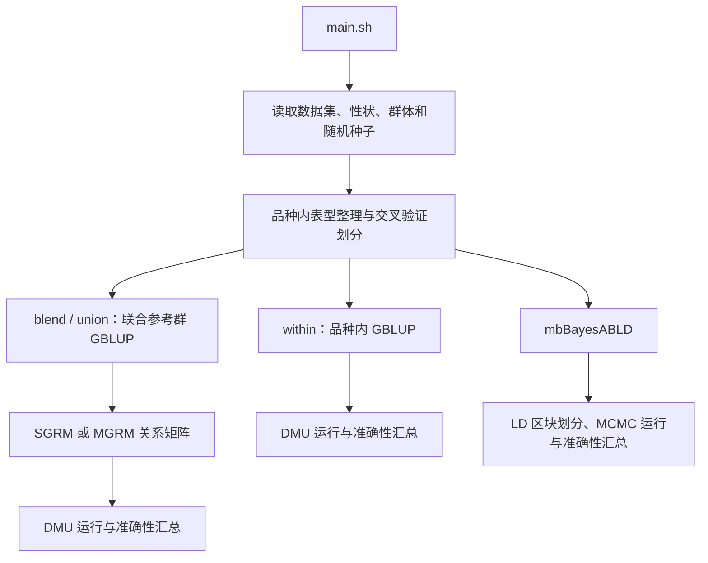

# CPGP：纯种-杂种联合参考群基因组预测分析流程

CPGP（Crossbred-Purebred Joint Genomic Prediction）用于复现本研究中纯种和杂种联合参考群的基因组预测分析。本仓库以 Xie2021 猪数据集和 Lee2019 肉牛数据集为例，比较品种内 GBLUP、纯种-杂种联合参考群下的单性状和多性状 GBLUP、常规基因组关系矩阵（SGRM）、多群体基因组关系矩阵（MGRM）以及 mbBayesABLD 模型在纯种验证群中的预测表现。

本说明书针对当前 CPGP 仓库编写，并围绕本项目的真实数据、脚本结构、模型设置、输入输出文件、常见运行方案和排错过程进行详细说明。用户应能根据本说明书从基础输入文件出发，完成交叉验证和主要结果复现。

> 使用本仓库时，请引用对应论文、原始数据来源和相关软件。`code/bin/` 中的二进制程序仅用于复现本项目分析，其他用途需遵守对应软件作者或发布机构的许可协议。

# User Manual

- [1. 项目简介](#1-项目简介)
- [2. 运行环境和依赖](#2-运行环境和依赖)
- [3. 获取代码和数据](#3-获取代码和数据)
- [4. 仓库目录结构](#4-仓库目录结构)
- [5. 初始化脚本 initialize.sh](#5-初始化脚本-initializesh)
- [6. main.sh 工作流程详解](#6-mainsh-工作流程详解)
- [7. 主要脚本和用法](#7-主要脚本和用法)
- [8. 输入文件格式和检查](#8-输入文件格式和检查)
- [9. 输出文件说明](#9-输出文件说明)
- [10. 常见运行方案和示例命令](#10-常见运行方案和示例命令)
- [11. 性能建议和参数调整](#11-性能建议和参数调整)
- [12. Troubleshooting：常见错误和定位方法](#12-troubleshooting常见错误和定位方法)
- [13. FAQ](#13-faq)
- [14. License and citation](#14-license-and-citation)
- [15. Contact and acknowledgements](#15-contact-and-acknowledgements)
- [Appendix A：完整复现示例](#appendix-a完整复现示例)
- [Appendix B：脚本调用链](#appendix-b脚本调用链)
- [Appendix C：典型输出目录](#appendix-c典型输出目录)

# 1. 项目简介

本项目的科学问题是：在纯种和杂种之间存在遗传联系但遗传相关不一定为 1 的情况下，杂种记录是否可以作为额外参考信息，提高纯种验证群的基因组预测准确性。该问题与实际育种工作密切相关，因为杂种个体通常不是主要留种对象，但它们的表型和基因型可能反映纯种亲本群体在商业生产环境中的遗传表现。

本项目包含两个真实数据集：

- Xie2021 猪数据集：包括 Yorkshire（YY）、Landrace（LL）和 Landrace × Yorkshire 杂种（LY）个体。分析性状为 PFAI 和 MS。
- Lee2019 肉牛数据集：包括 Angus（AAN）、Limousin（LIM）和 Lim-Flex（LF）个体。分析性状为 BWT 和 WWT。

本项目比较以下模型或分析场景：

- 品种内 GBLUP：只使用目标群体自身训练集作为参考群；
- 单性状联合 GBLUP：将纯种和杂种共同作为参考群，使用单性状模型；
- 多性状联合 GBLUP：将不同群体或群体来源记录作为相关性状联合建模；
- SGRM：常规 VanRaden 类型基因组关系矩阵；
- MGRM：考虑群体等位基因频率差异的多群体关系矩阵，由 MTG2 构建；
- mbBayesABLD：基于 LD 区块并允许区块层面异质遗传协方差结构的多群体贝叶斯模型。

流程基本设计是：先进行品种内交叉验证，生成每个群体的统一验证折、验证个体 ID 和校正表型；随后在同一性状目录下运行不同联合参考群和模型，使不同模型在相同验证划分下比较预测准确性、无偏性和相关输出。

[back to top](#user-manual)

# 2. 运行环境和依赖

## 2.1 操作系统和硬件建议

建议在 Linux 服务器上运行。本项目脚本为 Bash 脚本，不依赖 Slurm、PBS 或 LSF 等作业管理系统。整理后的脚本默认在普通多核 Linux 服务器上直接运行。

推荐环境：

- 操作系统：CentOS、Rocky Linux、Ubuntu、Debian 或其他主流 Linux 发行版；
- CPU：完整运行建议至少 20 个核心；
- 内存：GBLUP 建议 32 GB 以上，MGRM 和 mbBayesABLD 建议 64 GB 以上；
- 磁盘空间：建议预留 50 GB 以上，用于交叉验证目录、关系矩阵、中间 PLINK 文件、DMU 输出和日志。

若只做流程测试，可降低 `REP`、`FOLD`、`THREADS`、`MCMC_CYCLES` 和 `BURNIN`。

## 2.2 软件依赖

运行前需要以下软件或命令：

```text
bash
R / Rscript
PLINK
DMU: dmu1, dmuai, run_dmu4, run_dmuai
MTG2
mbBayesABLD
gmatrix
awk, sed, grep, sort, uniq, wc, find, getopt
```

本仓库将复现所需的部分程序放在 `code/bin/` 中。`main.sh` 会将 `code/bin/` 加入 `PATH`，因此通常不需要在系统环境中单独设置这些程序路径。

## 2.3 R 包依赖

建议提前安装以下 R 包：

```r
install.packages(c("data.table", "dplyr", "tidyr", "stringr", "getopt", "Matrix"))
```

部分扩展脚本可能需要 `Rcpp`、`RcppArmadillo`、`ggplot2` 或其他包。如果运行时报错提示缺少 R 包，请按报错信息补充安装。

## 2.4 二进制程序说明

`code/bin/` 中当前包含：

```text
plink
mtg2
dmu1
dmuai
run_dmu4
run_dmuai
gmatrix
ldblock
LD_mean_r2
mbBayesABLD
QMSim_selected
```

这些程序只作为复现本项目分析结果的辅助文件提供。任何其他用途均需遵守对应软件作者、开发团队或发布机构的许可协议。

[back to top](#user-manual)

# 3. 获取代码和数据

## 3.1 从 GitHub 克隆仓库

```bash
cd /path/to/workspace
git clone <repository-url> CPGP
cd CPGP
```

克隆后检查：

```bash
ls README_cn.md main.sh initialize.sh code data
```

## 3.2 使用压缩包离线部署

```bash
cd /path/to/workspace
unzip CPGP-main.zip
mv CPGP-main CPGP
cd CPGP
```

如果脚本来自 Windows 环境，必要时转换换行符：

```bash
dos2unix main.sh initialize.sh code/*.sh code/shell/*.sh
```

## 3.3 部署后检查

仓库根目录应包含：

```text
README.md
README_cn.md
LICENSE
initialize.sh
main.sh
code/
data/
```

`data/` 下应包含：

```text
data/Xie2021/
data/Lee2019/
```

[back to top](#user-manual)

# 4. 仓库目录结构

## 4.1 顶层结构

```text
CPGP/
|-- README.md
|-- README_cn.md
|-- LICENSE
|-- initialize.sh
|-- main.sh
|-- code/
|   |-- Lee2019.sh
|   |-- Xie2021.sh
|   |-- R/
|   |-- shell/
|   `-- bin/
|-- data/
|   |-- Xie2021/
|   |-- Lee2019/
|   |-- logs/                 # 运行后生成
```

## 4.2 关键文件说明

- `main.sh`：统一入口脚本。用户主要修改 `PROJECT_ROOT`、`DATASETS`、`THREADS`、`FOLD`、`REP`、`RUN_STEPS` 和 MCMC 参数。
- `initialize.sh`：初始化检查脚本。检查基础输入文件、二进制程序、Rscript 和 Shell 语法。
- `code/shell/template_within.sh`：品种内 GBLUP 模板脚本。
- `code/shell/template_blend_union.sh`：联合参考群 GBLUP 模板脚本。
- `code/shell/template_multi.sh`：mbBayesABLD 模板脚本。
- `code/shell/accur_dmu_SS_GBLUP.sh`：品种内 GBLUP 交叉验证核心脚本。
- `code/shell/accur_multi_breed.sh`：联合 GBLUP 和 mbBayesABLD 交叉验证核心脚本。
- `code/shell/MTG2.sh`：多群体基因组关系矩阵构建脚本。
- `code/shell/bin_define_ldblock.sh`：LD 区块划分脚本。
- `code/R/`：表型整理、准确性计算、关系矩阵处理、LD 区块、局部遗传相关和 MCMC 诊断脚本。
- `code/bin/`：复现流程需要的二进制程序。

`code/Lee2019.sh` 和 `code/Xie2021.sh` 当前只保留为兼容提示脚本，不再作为主入口使用。

## 4.3 数据集目录

Xie2021 基础输入文件：

```text
data/Xie2021/Genotype.id.qc.bed
data/Xie2021/Genotype.id.qc.bim
data/Xie2021/Genotype.id.qc.fam
data/Xie2021/phenotypes_dmu.txt
data/Xie2021/seed.txt
```

Lee2019 基础输入文件：

```text
data/Lee2019/Lee2019q.bed
data/Lee2019/Lee2019q.bim
data/Lee2019/Lee2019q.fam
data/Lee2019/phenotype.txt
data/Lee2019/seed.txt
```

运行后，每个数据集目录下会继续生成性状目录、参考群目录、交叉验证目录和日志目录。

[back to top](#user-manual)

# 5. 初始化脚本 initialize.sh

## 5.1 初始化命令

```bash
cd /path/to/CPGP
bash initialize.sh
```

如果没有执行权限：

```bash
chmod +x initialize.sh main.sh code/*.sh code/shell/*.sh
bash initialize.sh
```

## 5.2 初始化检查内容

`initialize.sh` 会检查：

1. Xie2021 和 Lee2019 的基础输入文件是否存在；
2. `code/bin/` 中的 `plink`、`gmatrix`、`dmu1`、`dmuai`、`run_dmu4`、`run_dmuai`、`mtg2`、`mbBayesABLD`、`ldblock` 和 `LD_mean_r2` 是否存在；
3. 二进制程序和 Shell 脚本是否有执行权限；
4. `code/*.sh` 和 `code/shell/*.sh` 是否能通过 Bash 语法检查；
5. `Rscript` 是否可调用；
6. `data/logs/` 和 `data/generated_scripts/` 是否存在，不存在则自动创建。

## 5.3 初始化失败时的处理

如果出现 `Missing` 或 `Missing executable`，说明对应文件不存在或为空。请检查文件是否复制到正确目录。

如果提示 `Rscript` 缺失：

```bash
which Rscript
Rscript --version
```

如果服务器使用环境模块：

```bash
module load R
```

如果 Shell 语法检查失败，优先检查换行符：

```bash
dos2unix main.sh initialize.sh code/*.sh code/shell/*.sh
```

[back to top](#user-manual)

# 6. main.sh 工作流程详解

## 6.1 顶层参数

`main.sh` 中主要参数为：

```bash
PROJECT_ROOT="/path/to/CPGP"
DATASETS=("Xie2021" "Lee2019")
THREADS=25
FOLD=5
REP=10
MCMC_CYCLES=30000
BURNIN=20000
THIN=10
RUN_STEPS=("within" "joint" "bayes" "mgrm")
```

含义：

- `PROJECT_ROOT`：仓库根目录，必须修改为真实路径；
- `DATASETS`：需要运行的数据集；
- `THREADS`：并行线程数；
- `FOLD`：交叉验证折数；
- `REP`：交叉验证重复次数；
- `MCMC_CYCLES`：mbBayesABLD 总迭代次数；
- `BURNIN`：mbBayesABLD burn-in 次数；
- `THIN`：MCMC thinning 参数，当前保留为全局参数；
- `RUN_STEPS`：选择运行哪些步骤。

`RUN_STEPS` 可选值：

```text
within   品种内 GBLUP
joint    联合参考群 GBLUP，使用 SGRM
mgrm     联合参考群 GBLUP，使用 MGRM
bayes    mbBayesABLD
```

## 6.2 数据集参数

Xie2021 默认设置：

```bash
project="Xie2021"
bfile="${PROJECT_ROOT}/data/Xie2021/Genotype.id.qc"
phef="${PROJECT_ROOT}/data/Xie2021/phenotypes_dmu.txt"
breeds="YY LL LY"
traits="PFAI MS"
trait_indices="1 2"
all_eff="'3 2 1'"
combinations="YY LY" "LL LY" "YY LL LY"
```

Lee2019 默认设置：

```bash
project="Lee2019"
bfile="${PROJECT_ROOT}/data/Lee2019/Lee2019q"
phef="${PROJECT_ROOT}/data/Lee2019/phenotype.txt"
breeds="AAN LF LIM"
traits="BWT CE CW DOC MARB MCE MILK REA SCRO STAY WWT YG YWT"
trait_indices="1 11"
all_eff="'2 1'"
combinations="AAN LF" "LF LIM" "AAN LF LIM"
```

`trait_indices` 是 `traits` 数组中的 1-based 序号。Lee2019 虽列出多个性状名称，但当前默认只分析 BWT 和 WWT。

## 6.3 随机数种子

每个数据集有一个 `seed.txt`：

```text
data/Xie2021/seed.txt
data/Lee2019/seed.txt
```

`main.sh` 渲染模板时读取对应种子。保持同一 `seed.txt` 可保证交叉验证划分尽可能一致。

## 6.4 分析流程图



注意：关系矩阵构建只属于联合 GBLUP 分支。品种内 GBLUP 和 mbBayesABLD 不使用该分支生成的多群体 G 矩阵。

## 6.5 品种内 GBLUP

品种内评估目录形式：

```text
data/<dataset>/<trait>/<breed>/
```

示例：

```text
data/Xie2021/MS/YY/
data/Xie2021/MS/LL/
data/Lee2019/BWT/AAN/
data/Lee2019/BWT/LIM/
```

该步骤完成群体基因型提取、表型整理、校正表型生成、交叉验证划分和 DMU 预测。联合模型依赖该步骤生成的 `val*/rep*/` 目录。

## 6.6 联合参考群 GBLUP

联合 GBLUP 包括：

- `blend`：单性状联合 GBLUP；
- `union`：多性状联合 GBLUP。

同时比较：

- `SGRM`：常规 G 矩阵；
- `MGRM`：多群体 G 矩阵。

输出目录命名规则：

```text
blend_SGRM_<pop1>_<pop2>
blend_MGRM_<pop1>_<pop2>
union_SGRM_<pop1>_<pop2>
union_MGRM_<pop1>_<pop2>
```

示例：

```text
data/Xie2021/MS/blend_SGRM_YY_LY/
data/Xie2021/MS/union_MGRM_YY_LL_LY/
data/Lee2019/BWT/blend_MGRM_AAN_LF_LIM/
data/Lee2019/WWT/union_SGRM_LF_LIM/
```

## 6.7 MGRM 构建

MGRM 场景由 `accur_multi_breed.sh` 调用 `MTG2.sh`。主要步骤包括：

1. 合并参与联合评估的群体基因型；
2. 根据 `.fam` 文件第一列 FID 生成群体分组；
3. 识别并剔除单态 SNP；
4. 调用 MTG2 构建多群体 G 矩阵；
5. 转换关系矩阵 ID；
6. 根据需要生成逆矩阵供 DMU 使用。

## 6.8 mbBayesABLD

mbBayesABLD 由 `template_multi.sh` 和 `accur_multi_breed.sh` 完成。主要步骤包括：

1. 合并参考群基因型；
2. 生成或读取 LD 区块；
3. 合并多群体交叉验证表型；
4. 设置方差先验和遗传相关参数；
5. 调用 `mbBayesABLD` 运行 MCMC；
6. 输出验证个体 GEBV；
7. 计算预测准确性、无偏性和秩相关。

输出目录命名：

```text
multi_<pop1>_<pop2>
multi_<pop1>_<pop2>_<pop3>
```

[back to top](#user-manual)

# 7. 主要脚本和用法

## 7.1 main.sh

完整运行：

```bash
bash main.sh
```

只运行 Xie2021：

```bash
DATASETS=("Xie2021")
```

只运行品种内和 SGRM 联合 GBLUP：

```bash
RUN_STEPS=("within" "joint")
```

只补跑 mbBayesABLD：

```bash
RUN_STEPS=("bayes")
```

## 7.2 template_within.sh

由 `main.sh` 渲染，调用：

```text
code/shell/dmu_get_pheno_adj.sh
code/shell/accur_dmu_SS_GBLUP.sh
```

渲染脚本保存在：

```text
data/generated_scripts/<dataset>_within_<trait_index>.sh
```

## 7.3 template_blend_union.sh

负责联合 GBLUP。根据 `GmatM` 自动区分：

```text
GmatM=single -> blend_SGRM_* 或 union_SGRM_*
GmatM=MTG2   -> blend_MGRM_* 或 union_MGRM_*
```

## 7.4 template_multi.sh

负责 mbBayesABLD，向 `accur_multi_breed.sh` 传递 MCMC、LD 区块、参考群组合和准确性输出参数。

## 7.5 accur_dmu_SS_GBLUP.sh

品种内 GBLUP 核心脚本。常用参数：

```text
--label       群体名称
--phef        群体表型文件
--DIR         DMU 输出前缀，品种内为 within
--bfile       PLINK 基因型前缀
--all_eff     固定效应列
--ran_eff     随机效应列
--seed        随机数种子
--rep         重复次数
--fold        折数
--phereal     当前分析性状序号
--tbvf        校正表型或参考值文件
--thread      并行线程数
--out         准确性输出文件名
```

## 7.6 accur_multi_breed.sh

联合 GBLUP 和 mbBayesABLD 核心脚本。常用参数：

```text
--pops        参与联合评估的群体，如 "YY LY"
--type        blend、union 或 multi
--GmatM       single、MTG2 或 multi
--fold        折数
--rep         重复次数
--tbvf        校正表型文件
--phereal     当前分析性状序号
--thread      并行线程数
--software    mbBayesABLD 软件类型参数，当前为 C
--bin         LD 区块策略，当前为 cubic
--iter        MCMC 总迭代次数
--burnin      burn-in 次数
--rg          遗传相关初始值或先验设置
--priorVar    方差先验来源
--suffix      输出目录中加入群体组合
--code        code 目录路径
--out         准确性输出前缀
```

## 7.7 R 脚本

主要 R 脚本功能：

- `pheno_adj.R`：根据 DMU 输出计算校正表型；
- `pheno_grouped.R`：生成交叉验证分组表型；
- `pheno_miss.R`：将验证群表型设置为缺失；
- `pheno_merge_pop.R`：合并多个群体的交叉验证表型；
- `accur_dmu_bayes_cal.R`：计算预测准确性、无偏性、秩相关和验证群大小；
- `bins_define.R`：根据 SNP 图谱和 LD 信息生成区块；
- `cubic_smoothing_block.R`：生成 cubic 风格区块定义；
- `variance_prior.R`：生成 mbBayesABLD 方差先验；
- `local_block_rg.R`：估计局部区块遗传相关；
- `MCMC_chain_plot.R`：整理 MCMC 链诊断信息；
- `update_grm_ids.R` 和 `G_inv.R`：处理关系矩阵 ID 和逆矩阵。

[back to top](#user-manual)

# 8. 输入文件格式和检查

## 8.1 PLINK 基因型文件

每个数据集使用 PLINK 二进制格式：

```text
<prefix>.bed
<prefix>.bim
<prefix>.fam
```

`.fam` 第一列 FID 表示群体或品种，例如：

```text
YY individual_001 0 0 0 -9
LL individual_002 0 0 0 -9
LY individual_003 0 0 0 -9
```

## 8.2 表型文件

表型文件为空格或制表符分隔文本。脚本假设第一列为个体 ID，后续列为固定效应、随机效应或性状。表型 ID 需要与 `.fam` 第二列 IID 匹配。

Xie2021：

```text
data/Xie2021/phenotypes_dmu.txt
```

Lee2019：

```text
data/Lee2019/phenotype.txt
```

## 8.3 随机数种子文件

```text
data/Xie2021/seed.txt
data/Lee2019/seed.txt
```

文件中只需包含一个整数。

## 8.4 参考群组合

`main.sh` 自动写入：

```text
data/Xie2021/breeds_combination.txt
data/Lee2019/breeds_combination.txt
```

Xie2021 默认组合：

```text
YY LY
LL LY
YY LL LY
```

Lee2019 默认组合：

```text
AAN LF
LF LIM
AAN LF LIM
```

[back to top](#user-manual)

# 9. 输出文件说明

## 9.1 品种内评估输出

示例目录：

```text
data/Xie2021/MS/YY/
data/Lee2019/BWT/AAN/
```

常见文件：

```text
<breed>.bed / <breed>.bim / <breed>.fam
<breed>_dmu.txt
phe_adj_PBLUP.txt
val1/rep1/pheno.txt
val1/rep1/val.id
val1/rep1/within.DIR
val1/rep1/within.SOL
val1/rep1/within.lst
accur_GBLUP.txt 或 accuracy_*.txt
```

## 9.2 联合 GBLUP 输出

示例目录：

```text
data/Xie2021/MS/blend_SGRM_YY_LY/
data/Xie2021/MS/union_MGRM_YY_LL_LY/
data/Lee2019/WWT/blend_MGRM_LF_LIM/
```

常见文件：

```text
merge.bed / merge.bim / merge.fam
merge.agrm.id_fmt
merge.agiv.id_fmt
merge.grm
merge.grm.inv
pedi_merge.txt
val1/rep1/pheno.txt
val1/rep1/blend.DIR
val1/rep1/blend.SOL
val1/rep1/blend.lst
val1/rep1/union.DIR
val1/rep1/union.SOL
val1/rep1/union.lst
accur_GBLUP_*.txt
```

## 9.3 mbBayesABLD 输出

示例目录：

```text
data/Xie2021/MS/multi_YY_LY/
data/Lee2019/BWT/multi_AAN_LF_LIM/
```

常见文件：

```text
merge.bed / merge.bim / merge.fam
bins.txt 或 cubic 相关区块文件
val1/rep1/pheno.txt
val1/rep1/EBV_cubic_y1.txt
val1/rep1/effect_cubic_*.txt
val1/rep1/var_cubic_*.txt
val1/rep1/MCMC_process.txt_cubic
val1/rep1/cubic_*_gibs_*.log
accur_bayes_*.txt
```

## 9.4 准确性结果字段

准确性结果通常包括：

```text
rep
fold
cor
bias
rank_cor
n_validation
```

含义：

- `cor`：预测值与校正表型或参考值的 Pearson 相关；
- `bias`：回归斜率，用于评估预测无偏性；
- `rank_cor`：秩相关；
- `n_validation`：验证群个体数。

部分结果文件最后一行为均值行，整理时不要重复计算。

## 9.5 日志文件

日志保存在：

```text
data/logs/
```

示例：

```text
data/logs/Xie2021_MS_blend_SGRM_YY_LY_local.log
data/logs/Lee2019_BWT_multi_AAN_LF_LIM_C_cubic_local.log
```

[back to top](#user-manual)

# 10. 常见运行方案和示例命令

## 10.1 完整运行

```bash
cd /path/to/CPGP
bash initialize.sh
# 编辑 main.sh 中的 PROJECT_ROOT
bash main.sh
```

## 10.2 只运行一个数据集

```bash
DATASETS=("Xie2021")
```

或：

```bash
DATASETS=("Lee2019")
```

## 10.3 只运行品种内和 SGRM 联合 GBLUP

```bash
RUN_STEPS=("within" "joint")
```

若品种内结果已经存在，只补跑联合 SGRM：

```bash
RUN_STEPS=("joint")
```

## 10.4 降低重复数测试流程

```bash
THREADS=4
FOLD=2
REP=1
MCMC_CYCLES=2000
BURNIN=1000
RUN_STEPS=("within" "joint")
```

该设置仅用于测试，不用于复现论文结果。

[back to top](#user-manual)

# 11. 性能建议和参数调整

- `THREADS` 不应超过服务器可用核心数。
- `REP × FOLD` 决定每个模型的交叉验证任务数量。
- MGRM 构建通常比 SGRM 更耗时，因为需要合并基因型并调用 MTG2。
- mbBayesABLD 耗时受 SNP 数、区块数、MCMC 迭代次数、参考群规模和群体数量影响。
- 如果资源有限，建议先运行 `within` 和 `joint`，确认 GBLUP 流程正常后再运行 `bayes` 和 `mgrm`。
- 如果某个场景目录已经存在，模板脚本会停止该场景以避免覆盖。重新运行前请备份或删除对应目录。

[back to top](#user-manual)

# 12. Troubleshooting：常见错误和定位方法

**问题 1：提示 `Please edit PROJECT_ROOT in main.sh before running.`**

说明 `PROJECT_ROOT` 仍是默认占位路径。请改为仓库真实路径。

**问题 2：提示 PLINK 文件不存在。**

检查 `.bed`、`.bim`、`.fam` 是否同时存在，且前缀与 `main.sh` 中 `bfile` 一致。

**问题 3：提示某个 FID 在 `.fam` 中不存在。**

检查 `.fam` 第一列是否为群体标签，例如 `YY`、`LL`、`LY`、`AAN`、`LF`、`LIM`。

**问题 4：联合模型提示 `val.id` 或 `pheno.txt` 缺失。**

联合模型依赖品种内交叉验证划分。请先运行：

```bash
RUN_STEPS=("within")
```

**问题 5：DMU 没有生成 `.SOL` 或 `.lst`。**

查看 `data/logs/` 中对应日志，并检查 `dmu1`、`dmuai`、`run_dmu4` 和 `run_dmuai` 是否有执行权限。

**问题 6：MGRM 没有生成 `merge.grm`。**

检查 `mtg2` 和 `plink` 是否可执行，合并基因型是否成功，以及群体 FID 是否正确。

**问题 7：mbBayesABLD 没有生成 `EBV_cubic_y*.txt`。**

检查 LD 区块是否生成，`mbBayesABLD` 是否可执行，MCMC 日志中是否有输入格式、内存或维度错误。

**问题 8：中文 README 显示乱码。**

本文件使用 UTF-8 保存。建议使用 VS Code、Typora、Notepad++ 或 GitHub 网页预览。Linux 终端可设置：

```bash
export LANG=en_US.UTF-8
export LC_ALL=en_US.UTF-8
```

[back to top](#user-manual)

# 13. FAQ

**Q1：为什么输出文件直接写入 data 目录？**

每个数据集的输入文件、性状目录、参考群目录和模型输出都保存在同一数据集路径下，便于检查和迁移。

**Q2：可以跳过品种内评估直接运行联合模型吗？**

不可以。联合模型需要品种内评估生成的交叉验证划分、验证个体 ID 和校正表型。

**Q3：为什么联合 GBLUP 目录要区分 SGRM 和 MGRM？**

两类 G 矩阵不同，输出也不同。若使用同一目录，会导致结果覆盖或目录已存在而停止运行。

**Q4：可以只运行某一个参考群组合吗？**

可以。修改 `main.sh` 中对应数据集 `run_dataset` 后面的组合列表，只保留需要的组合。

**Q5：修改 `REP` 和 `FOLD` 会影响复现结果吗？**

会。论文复现应使用默认重复数和折数，并且需要使用数据集文件夹中的随机数种子。降低参数只适合流程测试。

[back to top](#user-manual)

# 14. License and citation

仓库脚本和说明文档遵循 `LICENSE` 文件中的许可。`code/bin/` 下第三方或已有软件的许可不由本仓库授权，用户需遵守对应软件作者或发布机构的协议。

原始数据来源：

- Xie L., Qin J., Rao L., Tang X., Cui D., Chen L., Xu W., Xiao S., Zhang Z., Huang L. 2021. Accurate prediction and genome-wide association analysis of digital intramuscular fat content in longissimus muscle of pigs. Animal Genetics 52:633-644.
- Lee J., Kim J. M., Garrick D. J. 2019. Increasing the accuracy of genomic prediction in pure-bred Limousin beef cattle by including cross-bred Limousin data and accounting for an F94L variant in MSTN. Animal Genetics 50:621-633.

使用模型或流程时，还应引用 mbBayesABLD、GBLUP、MTG2、PLINK、DMU 和多群体基因组预测相关方法文献。

[back to top](#user-manual)

# 15. Contact and acknowledgements

如遇到运行、数据格式、模型参数或复现结果问题，请在 GitHub Issues 中提交问题，或联系项目维护者。提交问题时建议提供：

- 操作系统和服务器环境；
- R、PLINK、DMU、MTG2 和 mbBayesABLD 版本；
- 修改后的 `main.sh` 参数；
- 报错场景目录；
- 对应 `data/logs/` 日志文件；
- 预期输出和实际输出差异。

感谢 High-performance Computing Platform of China Agricultural University 对相关分析提供计算支持。

[back to top](#user-manual)

# Appendix A：完整复现示例

假设仓库路径为 `/home/user/CPGP`。

```bash
cd /home/user
git clone <repository-url> CPGP
cd CPGP
bash initialize.sh
```

编辑 `main.sh`：

```bash
PROJECT_ROOT="/home/user/CPGP"
DATASETS=("Xie2021" "Lee2019")
THREADS=25
FOLD=5
REP=10
RUN_STEPS=("within" "joint" "bayes" "mgrm")
```

运行：

```bash
bash main.sh
```

检查日志和输出：

```bash
ls data/logs
tail -n 50 data/logs/Xie2021_PFAI_blend_SGRM_YY_LY_local.log
ls data/Xie2021/PFAI/YY/val1/rep1
ls data/Xie2021/PFAI/blend_SGRM_YY_LY
ls data/Lee2019/BWT/multi_AAN_LF
```

[back to top](#user-manual)

# Appendix B：脚本调用链

```text
main.sh
|-- code/shell/template_within.sh
|   |-- code/shell/dmu_get_pheno_adj.sh
|   |   `-- code/R/pheno_adj.R
|   `-- code/shell/accur_dmu_SS_GBLUP.sh
|       |-- code/R/pheno_grouped.R
|       |-- code/R/pheno_miss.R
|       |-- code/R/accur_dmu_bayes_cal.R
|       `-- code/bin/dmu* / run_dmu*
|-- code/shell/template_blend_union.sh
|   `-- code/shell/accur_multi_breed.sh
|       |-- code/R/pheno_merge_pop.R
|       |-- code/R/accur_dmu_bayes_cal.R
|       |-- code/shell/MTG2.sh
|       |-- code/bin/gmatrix
|       `-- code/bin/dmu* / run_dmu*
`-- code/shell/template_multi.sh
    `-- code/shell/accur_multi_breed.sh
        |-- code/shell/bin_define_ldblock.sh
        |-- code/R/bins_define.R
        |-- code/R/variance_prior.R
        |-- code/R/local_block_rg.R
        `-- code/bin/mbBayesABLD
```

[back to top](#user-manual)

# Appendix C：典型输出目录

Xie2021 示例：

```text
data/Xie2021/
|-- Genotype.id.qc.bed
|-- Genotype.id.qc.bim
|-- Genotype.id.qc.fam
|-- phenotypes_dmu.txt
|-- seed.txt
|-- breeds_combination.txt
|-- PFAI/
|   |-- YY/
|   |-- LL/
|   |-- LY/
|   |-- blend_SGRM_YY_LY/
|   |-- blend_MGRM_YY_LY/
|   |-- union_SGRM_YY_LL_LY/
|   |-- union_MGRM_YY_LL_LY/
|   `-- multi_YY_LL_LY/
`-- MS/
    |-- YY/
    |-- LL/
    |-- LY/
    |-- blend_SGRM_LL_LY/
    |-- blend_MGRM_LL_LY/
    |-- union_SGRM_YY_LL_LY/
    |-- union_MGRM_YY_LL_LY/
    `-- multi_YY_LL_LY/
```

Lee2019 示例：

```text
data/Lee2019/
|-- Lee2019q.bed
|-- Lee2019q.bim
|-- Lee2019q.fam
|-- phenotype.txt
|-- seed.txt
|-- breeds_combination.txt
|-- BWT/
|   |-- AAN/
|   |-- LF/
|   |-- LIM/
|   |-- blend_SGRM_AAN_LF/
|   |-- blend_MGRM_AAN_LF/
|   |-- blend_SGRM_LF_LIM/
|   |-- blend_MGRM_LF_LIM/
|   |-- union_SGRM_AAN_LF_LIM/
|   |-- union_MGRM_AAN_LF_LIM/
|   `-- multi_AAN_LF_LIM/
`-- WWT/
    |-- AAN/
    |-- LF/
    |-- LIM/
    |-- blend_SGRM_AAN_LF/
    |-- blend_MGRM_AAN_LF/
    |-- blend_SGRM_LF_LIM/
    |-- blend_MGRM_LF_LIM/
    |-- union_SGRM_AAN_LF_LIM/
    |-- union_MGRM_AAN_LF_LIM/
    `-- multi_AAN_LF_LIM/
```

[back to top](#user-manual)

